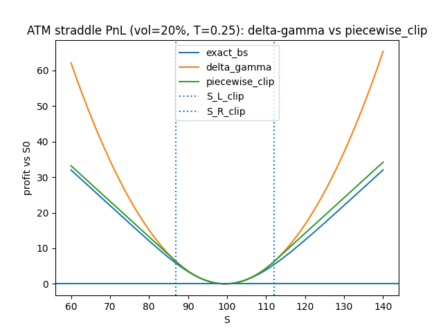

# Delta-Gamma

Delta-Gamma is a small Python project that compares fast, scenario-based PnL approximations for an at-the-money (ATM) option straddle against exact Black-Scholes repricing.

The goal is to keep the simplicity of a local delta-gamma (second-order Taylor) approximation near the current spot, while preventing the unrealistic quadratic blow-up in large moves by switching to linear tails.

## What it computes

Given a current spot S0 and an ATM straddle (1 call + 1 put, same strike K and maturity T), the script builds a pandas DataFrame across a grid of spot scenarios S:

- <b>pnl_exact_bs</b> 
  Exact PnL from repricing the straddle with Black-Scholes at each S and subtracting the initial value at S0.

- <b>pnl_delta_gamma</b> 
  Local second-order Taylor approximation about S0:
  pnl(S) = delta0 * (S-S0) + 0.5 * gamma0 * (S-S0)^2

- <b>pnl_piecewise_clip</b> 
  C1 piecewise quadratic/linear proxy:
  - quadratic in the middle (same formula as pnl_delta_gamma)
  - linear in the tails with slopes clipped to the natural straddle delta limits [-1, +1]
  The linear regions start where the linearized delta hits the bounds:
    x_L = (delta_L - delta0)/gamma0, x_R = (delta_R - delta0)/gamma0
    S_L = S0 + x_L, S_R = S0 + x_R
  For an ATM straddle, delta_L=-1, delta_R=+1 (and typically delta0 is near 0).

- <b>pnl_piecewise_fit_bs</b> 
  Same piecewise quadratic/linear shape, but the join points (S_L, S_R) are chosen so that the piecewise model matches Black-Scholes PnL at the joins while keeping the tail slopes fixed. This usually improves tail accuracy, at the cost of extra setup work (a small 1D root solve per side).

## Plot

The repository includes a plot generated by the script:

In the plot, dotted vertical lines show the piecewise_clip join points (S_L_clip and S_R_clip). The piecewise_clip curve coincides with pnl_delta_gamma between those lines and becomes linear outside.

## Requirements

- Python 3.9+ (works on newer versions as well)
- numpy
- pandas
- scipy
- matplotlib (optional, for plotting)

Install dependencies:

    pip install numpy pandas scipy matplotlib

## How to run

Run the script (replace with your file name if different):

    python delta_gamma_straddle.py

Edit the parameters near the top of the script to change:
- S0, K, T, sigma
- scenario grid range and spacing
- whether to show the plot

The script prints the key values (V0, delta0, gamma0, join points) and outputs the DataFrame in-memory. You can easily add:

    df.to_csv("results.csv", index=False)

if you want a file.

## Notes

- This is a PnL-vs-spot approximation at a fixed time T and fixed sigma (Black-Scholes). It does not model changes in implied volatility, skew/smile, or time decay across scenarios.
- The piecewise approximations are intended for fast scenario grids and stress testing where a full repricer is too slow.
